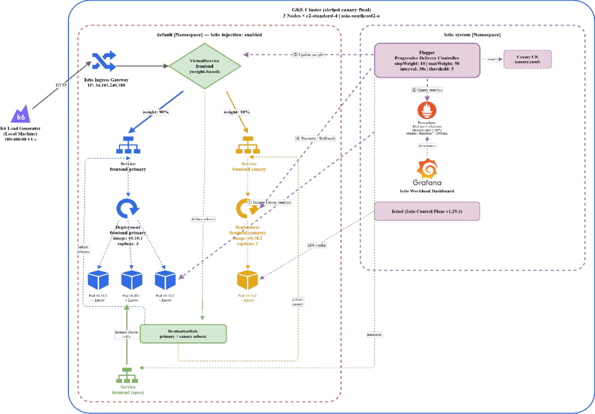
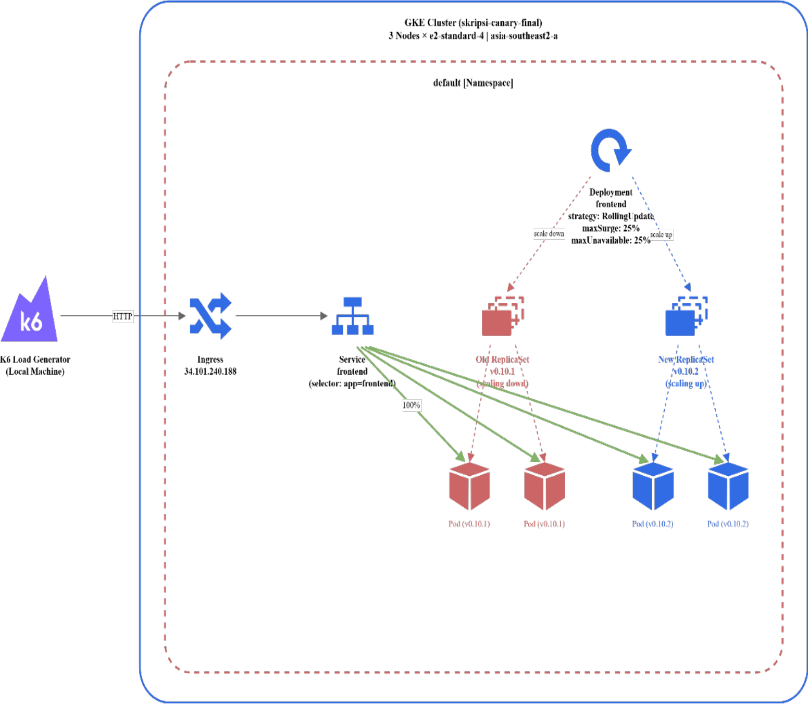
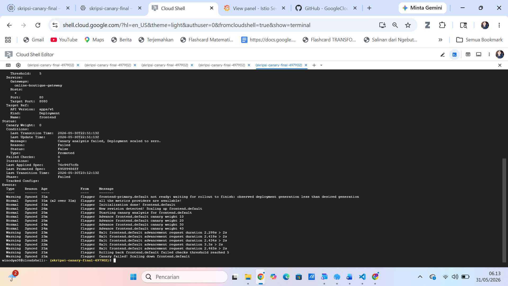
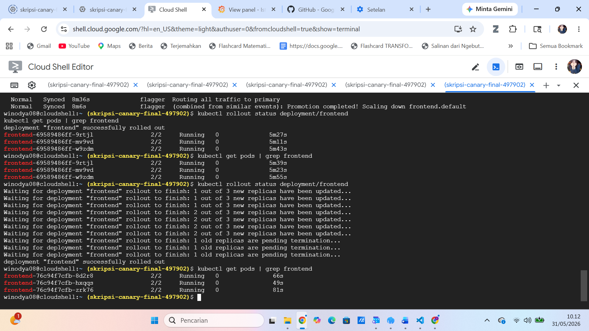
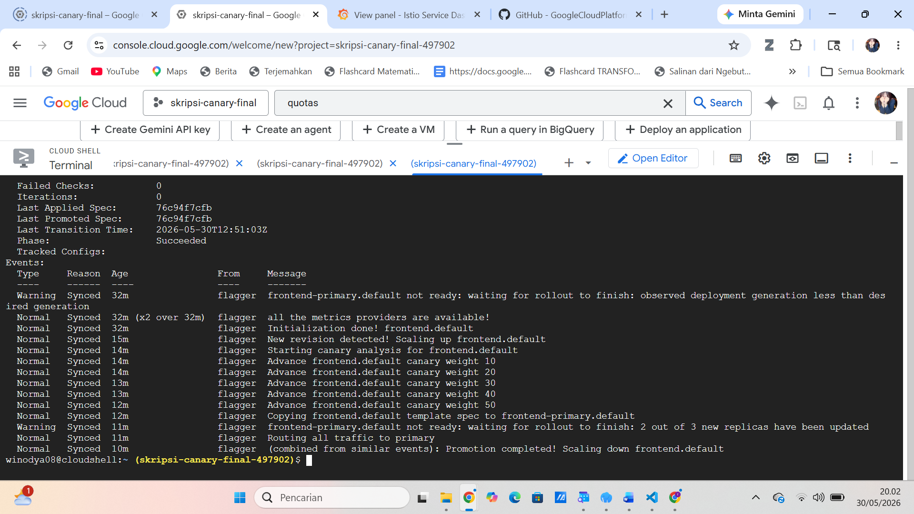

# Perbandingan Rolling Update vs Canary Deployment di GKE

Studi eksperimental membandingkan dua strategi deployment untuk aplikasi
microservices di Google Kubernetes Engine (GKE), menggunakan **Istio** sebagai
service mesh dan **Flagger** untuk progressive delivery. Fokusnya bukan mencari
"pemenang", melainkan memetakan **trade-off** antara keduanya di bawah beban berbeda.

## Ringkasan Temuan

Ini adalah trade-off, bukan satu strategi yang unggul mutlak:

- **Canary** membatasi *blast radius*. Saat metrik memburuk, Flagger otomatis
  **rollback** sebelum versi baru menjangkau seluruh pengguna (maksimal 50% sesuai
  `maxWeight`). Konsekuensinya: promosi lebih lambat dan bisa gagal walau versinya
  sehat, jika beban ekstrem menembus gate metrik.
- **Rolling Update** selalu menyelesaikan rollout ke **100% pengguna**. Ia punya
  deteksi per-pod lewat *readiness probe*, tetapi **tidak ada rollback berbasis
  metrik agregat** — tidak ada mekanisme yang menghentikan rollout karena latency
  atau error rate memburuk.
- Di beban **normal (Load)** dan **jangka panjang (Endurance)**, performa keduanya
  setara. Perbedaan baru muncul di beban **Stress**: Canary konsisten **rollback**
  karena latency menembus gate, sementara Rolling Update tetap menyelesaikan rollout.

## Arsitektur




**Stack:**
- Google Kubernetes Engine (zona `asia-southeast2-a`, 3 node `e2-standard-2`)
- Istio 1.29.1 (profile `demo`)
- Flagger (progressive delivery controller)
- Online Boutique (aplikasi microservices demo, v0.10.1 → v0.10.2)
- k6 (load testing)
- Prometheus & Grafana (observability, addon Istio)

## Cara Kerja Singkat

**Canary (Flagger):** trafik dialihkan bertahap ke versi baru (10% per langkah,
sampai maksimal 50%). Di tiap langkah Flagger mengevaluasi metrik dari telemetri
Istio. Jika lolos, promosi lanjut; jika gagal melampaui batas toleransi, otomatis
rollback.

Gate metrik (dari `infra/flagger/canary.yaml`):
- `request-success-rate` minimal **99%**
- `request-duration` maksimal **2000 ms** (diukur sebagai **P99 dari telemetri
  Istio** — berbeda dari threshold p95 di sisi k6)
- `stepWeight` 10, `maxWeight` 50, `interval` 30s, `threshold` 5

**Rolling Update:** mekanisme bawaan Deployment Kubernetes. Pod baru menggantikan
pod lama bertahap (`maxSurge` 1, `maxUnavailable` 0), berhenti hanya jika readiness
probe gagal. Tidak memantau metrik agregat, sehingga rollout tetap lanjut ke 100%
meski performa memburuk.

## Skenario Pengujian

Tiga skenario, masing-masing dijalankan pada versi Canary dan Rolling Update:

| Skenario   | Virtual Users   | Durasi     | Tujuan                   |
|------------|-----------------|------------|--------------------------|
| Load       | 100 VU          | 16 menit   | Beban normal             |
| Stress     | 400 VU (puncak) | 25 menit   | Beban ekstrem bertingkat |
| Endurance  | 80 VU           | 130 menit  | Ketahanan jangka panjang |

Skenario diimplementasikan di `k6-test/` (`load.js`, `stress.js`, `endurance.js`),
dengan fungsi request bersama di `k6-test/helpers/common.js`. Pola trafik:
40% browse frontpage, 30% browse produk, 15% add-to-cart + view cart,
15% add-to-cart + checkout.

## Hasil Pengujian

Lima repetisi (P1–P5) per skenario, per strategi. Data lengkap:
[`results/findings.md`](results/findings.md). Angka di bawah adalah kisaran
(terendah–tertinggi) dari P1–P5.

| Skenario | p95 latency (k6) | http_req_failed | Hasil Rolling | Hasil Canary |
|---|---|---|---|---|
| Load (100 VU) | RU 397–987 ms · Canary 524–1.100 ms | < 0,5% keduanya | rolled out (100%) | Promoted |
| Stress (400 VU) | RU 4.183–4.785 ms · Canary 4.177–4.729 ms | RU < 0,2% · Canary s/d 2,83% | rolled out (100%) | **Rollback** |
| Endurance (80 VU) | RU 544–691 ms · Canary 627–805 ms | < 0,3% keduanya | rolled out (100%) | Promoted |

Pada Endurance, penggunaan memori stabil ~12–15 MB untuk kedua strategi (tidak ada
indikasi memory leak).

### Bukti Visual

**Canary — rollback saat Stress** (versi sehat, tetapi P99 menembus gate 2000 ms):


**Rolling Update — tetap menyelesaikan rollout ke 100% saat Stress:**


**Canary — promosi sukses saat beban normal (pembanding):**


### Interpretasi

**Load & Endurance: setara.** Kedua strategi menyelesaikan rollout dengan latency
dan error rate jauh di bawah ambang. Tidak ada perbedaan performa berarti.

**Stress: di sinilah trade-off muncul.** Latency melonjak (p95 ~4.200–4.700 ms untuk
keduanya). Rolling Update tetap menyelesaikan rollout ke 100% — karena memang tidak
ada gate metrik yang menghentikannya. Canary **rollback di setiap repetisi**, karena
latency menembus gate `request-duration` Flagger (maks 2000 ms).

**Dua catatan agar tidak salah baca:**

1. **Gate Flagger ≠ threshold k6.** Kolom "standar ideal" pada data mentah sebagian
   besar mencerminkan threshold skrip k6 (mis. p95 < 5000 ms untuk Stress) — longgar
   dan berbeda per skenario. Gate promosi Flagger terpisah dan tetap:
   `request-duration` maks **2000 ms** (P99 telemetri Istio, bukan p95 k6) dan
   `request-success-rate` min 99%. Saat Stress, latency bisa lolos threshold k6 tetapi
   tetap menembus gate Flagger — itulah pemicu rollback.
2. **Rollback terjadi pada versi yang sehat.** Versi yang di-deploy bukan kode rusak
   (v0.10.1 → v0.10.2); rollback dipicu latency akibat beban, bukan cacat aplikasi.
   Jadi temuannya bukan "Canary menangkap kode buruk", melainkan **mekanisme
   deteksi-dan-rollback otomatis itu ada dan berfungsi**, membatasi dampak ke maksimal
   50% pengguna. Rolling Update, tanpa mekanisme setara, meneruskan perubahan ke
   seluruh pengguna apa pun kondisi metriknya.

## Cara Reproduce

```bash
# 1. Buat cluster GKE
gcloud container clusters create skripsi-canary \
  --zone asia-southeast2-a \
  --num-nodes 3 --machine-type e2-standard-2

# 2. Install Istio (profile demo)
istioctl install --set profile=demo -y
kubectl label namespace default istio-injection=enabled

# 3. Addon Prometheus & Grafana
kubectl apply -f https://raw.githubusercontent.com/istio/istio/release-1.29/samples/addons/prometheus.yaml
kubectl apply -f https://raw.githubusercontent.com/istio/istio/release-1.29/samples/addons/grafana.yaml

# 4. Install Flagger
kubectl apply -k github.com/fluxcd/flagger//kustomize/istio

# 5. Deploy Online Boutique (v0.10.1 sebagai baseline)
git clone --depth 1 --branch v0.10.1 \
  https://github.com/GoogleCloudPlatform/microservices-demo.git
kubectl apply -f microservices-demo/release/kubernetes-manifests.yaml

#    Matikan loadgenerator agar seluruh beban murni berasal dari k6
kubectl delete deployment loadgenerator

#    Set frontend ke baseline eksperimen: 3 replica, strategi Rolling Update
kubectl patch deployment frontend -p \
  '{"spec":{"replicas":3,"strategy":{"type":"RollingUpdate","rollingUpdate":{"maxSurge":1,"maxUnavailable":0}}}}'

#    Tunggu semua pod 2/2 Running, lalu verifikasi image baseline
kubectl get pods -w
kubectl get deploy frontend -o=jsonpath='{.spec.template.spec.containers[0].image}'
#    → harus berakhiran frontend:v0.10.1

# 6. Terapkan Gateway
kubectl apply -f infra/gateway.yaml

#    Untuk uji ROLLING UPDATE — pasang VirtualService manual:
kubectl apply -f infra/virtualservice.yaml

#    Untuk uji CANARY — hapus VS manual agar tidak bentrok, lalu pasang Canary:
kubectl delete -f infra/virtualservice.yaml --ignore-not-found
kubectl apply -f infra/flagger/canary.yaml

# 7. Jalankan uji beban (ambil EXTERNAL-IP ingress gateway terlebih dahulu)
kubectl get svc istio-ingressgateway -n istio-system
k6 run -e BASE_URL=http://<EXTERNAL_IP> k6-test/load.js
k6 run -e BASE_URL=http://<EXTERNAL_IP> k6-test/stress.js
k6 run -e BASE_URL=http://<EXTERNAL_IP> k6-test/endurance.js

# 8. Picu deployment versi baru saat uji sedang berjalan
#    (Load & Stress: menit ke-3 · Endurance: menit ke-7)
#    Registry diambil dari deployment yang sedang berjalan, hanya tag yang diganti,
#    sehingga tidak bergantung pada path registry yang berbeda antar rilis.
CURRENT_IMAGE=$(kubectl get deploy frontend \
  -o=jsonpath='{.spec.template.spec.containers[0].image}')
kubectl set image deployment/frontend \
  server=${CURRENT_IMAGE%:*}:v0.10.2
```

> **Catatan `loadgenerator`:** manifest Online Boutique menyertakan Deployment
> `loadgenerator` yang secara default menjalankan 10 pengguna simulasi. Deployment ini
> dihapus sebelum pengujian agar seluruh beban berasal murni dari k6 dan hasil
> pengukuran tidak terkontaminasi trafik latar.

> **Catatan VirtualService:** `online-boutique-vs` (VirtualService manual) bentrok
> dengan VirtualService yang di-generate otomatis oleh Flagger. Karena itu VS manual
> dipisah ke file tersendiri: dipasang untuk uji Rolling Update, dihapus sebelum uji
> Canary.

## Struktur Repo

```
.
├── infra/
│   ├── gateway.yaml            # Istio Gateway
│   ├── virtualservice.yaml     # VS manual (Rolling Update; dihapus saat uji Canary)
│   └── flagger/canary.yaml     # konfigurasi Canary (gate metrik Flagger)
├── k6-test/
│   ├── load.js                 # skenario Load (100 VU, 16 menit)
│   ├── stress.js               # skenario Stress (400 VU puncak, 25 menit)
│   ├── endurance.js            # skenario Endurance (80 VU, 130 menit)
│   └── helpers/common.js       # fungsi request + BASE_URL
├── docs/img/                   # diagram arsitektur & screenshot bukti
└── results/findings.md         # data mentah lengkap (P1–P5)
```

## Konteks

Dikembangkan sebagai bagian dari penelitian skripsi Teknik Informatika,
Telkom University Purwokerto.